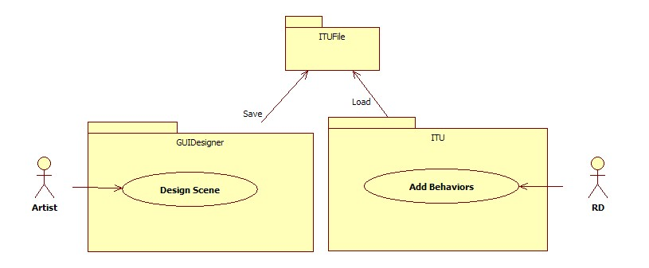
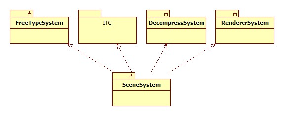
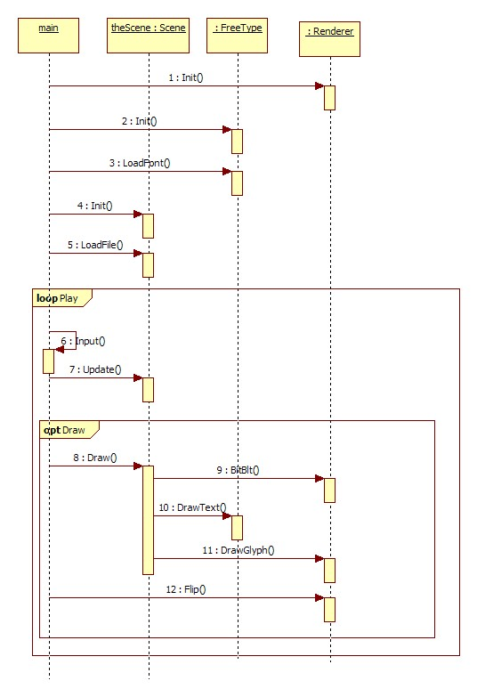
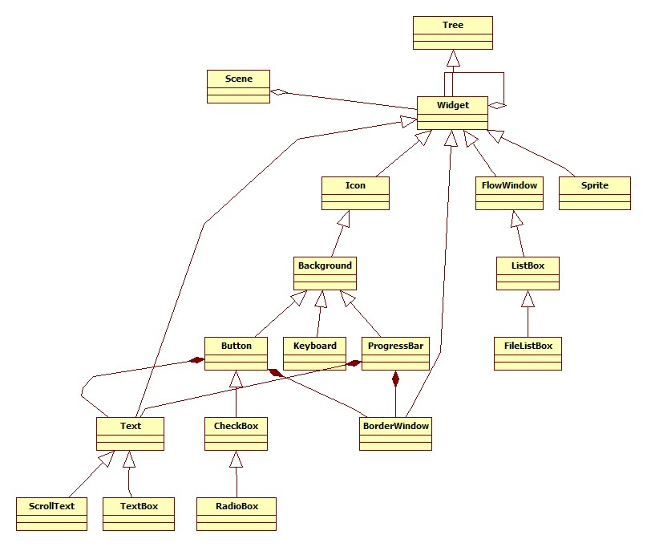
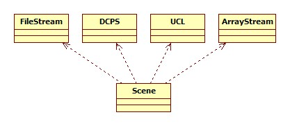
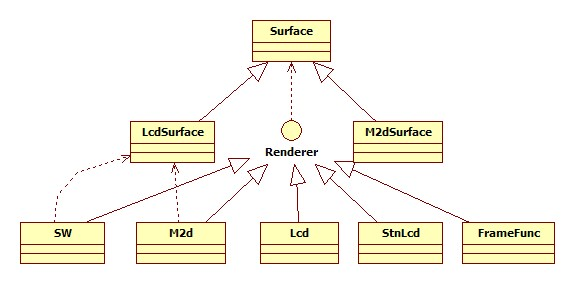
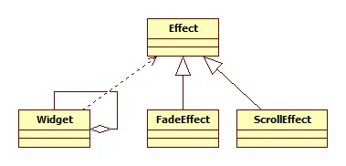

# GUI Designer {#itu_guidesigner}
# Overview {#itu_guidesigner_overview}
## Introduction

- ITU Library

    1. A UI library running on ITE Castor3 platform.
    2. Widget/scene tree based architecture.
    3. Written in C.
    4. Custom UI data format.

- GUI Designer

  1. A UI Editor tool running on WIN32 platform.
  2. To generate UI layout data for ITU library.
  3. UI layout data embedded raw bitmap data.
  4. Support Emulator.

## ITU Library Features

- Fast Loading

  1. The data layout in file is the same as in memory.
  2. Just call fread() once to read all UI data.
  3. Support HW decompress UI data file.

- Fast drawing

  1. Only drawing on content is changed

- Support multi-languages

  1. Up to 8 multi-languages

- Use FreeType as Text renderer

  1. Support font cache

- Support Multiple Renderers

  1. Software
  2. STN LCD
  3. M2D (HW)

- Support Transition Effects

  1. Fade In/Out
  2. Scroll Left/Up/Right/Down

- Support Screen Rotation

  1. 90 degree
  2. 180 degree
  3. 270 degree

- Support multiple input devices

  1. Keyboard
  2. Mouse
  3. Touch panel with Gesture events

## Widgets
- Widget, Layer, Background
- Icon
- Text, TextBox, ScrollText
- BorderWindow, FlowWindow
- Button, CheckBox, RadioBox, PopupButton
- ListBox, FileListBox, IconListBox, MediaFileListBox
- Sprite, SpriteButton
- ProgressBar, TrackBar, CircleProgressBar, ScrollBar
- Keyboard
- DigitalClock, AnalogClock
- Calendar
- Animation, Wheel, CoverFlow

## Actions
- Internal default behaviors defined by ITU library

  1. Triggered by events

- Event : event to trigger
- Target : All widgets or function
- Action

  1. Show, Hide : All widgets
  2. Focus : Buttons, TextBox
  3. Prev, Next, Back : ListBoxs
  4. Play, Stop, Goto : Sprite, Animation
  5. Language : Texts
  6. Input : TextBox, Keyboard
  7. Bind : Keyboard
  8. Clear : TextBox
  9. Enable, Disable : All widgets
  10. Check, UnCheck : CheckBox, RadioBox, ListBox
  11. Function : Callback function
  12. Reload : ListBox, ScrollBar

- Parameter : Max 32-byte characters

## GUI Designer Features
- Load/Save .xml
- Export .itu file
- Support compress .itu file
- Multiple Layers
- Undo/Redo
- Emulator

## System Architecture of ITU Library
- Use Case

  1. Artist uses GUI Designer to design UI and export .itu file
  2. RD uses ITU library to load/draw .itu file, and adds custom functions to specified widgets
  

- Main package

  1. SceneSystem : The ITU scene system to load/update/draw scene
  2. FreeTypeSystem : The font system to load/draw fonts
  3. ITC : The ITU Common Library for general functions like tree and stream.
  4. DecompressSystem : HW or SW decompress .itu file
  5. RendererSystem : draw bitmap to screen
  

- Runtime flow

  1. Initializes specified renderer.
  2. Initializes FreeType library.
  3. Loads specified font file.
  4. Initializes the scene.
  5. Loads .itu file.
  6. Gets events from input device(s).
  7. Updates the scene by input/timer events.
  8. Draws the scene, ITU will draw it by renderer/freetype's functions.
  9. Flip screen.
  

- Widget classes hierarchy

  1. The scene is composed by widget tree.
  2. Every widget can be inherited to extend another widget.
  3. Extended widget can overwrite parent's functions if neccssary.
  

- Modules for loading scene file

  1. ITU use ITC Stream library to load .itu file or embedded itu array.
  2. ITU decompress .itu file by HW DCPS module or SW libucl.
  

- Renderer system

  1. Every renderer implementation need to implement renderer interface.
  

- Effect system

  1. Every effect can be inherited to extend another effect.
  

## Release Notes {#itu_guidesigner_release_note}
- Version 1.1.7648, 2020/12/9
  1. Add item background image to ComboTable widget.
  2. Fixed the widget tree get wrong order when using Hided property.
- Version 1.1.7628, 2020/11/19
  1. Add ComboTable widget.
- Version 1.1.7530, 2020/8/13
  1. Remove all internal customdata usage.
  2. Add ItemAlign mode switch for StopAnywhere.
  3. Add Scale 50% option on Emulator menu.
  4. Show widget absolute position on status bar.
- Version 1.1.7430, 2020/05/05
  1. Add TableGrid widget.
  2. Add Speedy Compression option.
  3. Add Speedy Surface Compression option.
- Version 1.1.7276, 2019/12/03
  1. Add LineOnly property to Curve widget.
  2. Add TableBar widget.
  3. Add Stretch property to CheckBox/RadioBox/BackgroundButton/AnalogClock widgets.
  4. Add Static property to Curve widget.
  5. Adjust max change resolution to 4096x4096.
  6. Support Hebrew language.
- Version 1.1.6828, 2018/09/11
  1. Change compression format to suit 970 hardware.
  2. Export images to directories named by layer's name.
  3. Highlight hided widgets by bold font on TreeView.
  4. Add menu items and shotcuts for show/hide widgets.
  5. Inverse the order of imported sprite image.
  6. Add PreviewImage property to preview all status of images on Button/CheckBox/RadioBox widgets.
  7. Add DefaultImage property to replace BackgroundImage property on Button/CheckBox/RadioBox widgets.
  8. Add LetterSpacing property to TextBox widget.
  9. Add IsArabic1~IsArabic31 properties to text related widgets.
  10. Change default Unit property of Font to Pixel on text related widgets.
  11. Support kerning font preview on text widget.
  12. Add CacheCount property to CircleProgressBar widget.
- Version 1.0.6738, 2018/06/13
  1. Add StopAnywhere widget.
  2. Add Oscilloscope widget.
  3. Add MouseUpDelay/MouseLongPressDelay properties to Button widget.
  4. Add DrawGrid/GridSize/SnapToGrid properties to background related widgets.
  5. Add multi-line function to Text1-Text31 properties of TextBox widget.
  6. Implement What You See Is What You Get function on Text widget.
  7. Add popup button widget to reload action targets.
  8. Add LetterSpacing property to Text widget.
  9. Add Dither property to widgets with image.
  10. Add searching function name function.
  11. Add batch importing XML files function.
  12. Generating widget names as comments on creating layer code function.
  13. Rename duplicate image names on exporting images function.
  14. Expand tree view after copy/paste widget.
  15. Sync selected item of tree view with edit area and searching result.
  16. Add searching widget name/function on current layer function.
- Version 1.0.6638, 2018/03/05
  1. Add change resolution function on Edit menu.
  2. Add SimpleAnimation widget.
  3. Add Arabic text support.
  4. Add Import option.
  5. Add TextAlign property to Button/CheckBox/RadioBox/PopupRadioBox widgets.
- Version 1.0.6569, 2017/12/26
  1. Support to execute GUIDesigner by xml file double click.
  2. Expand multi-language count to 32.
  3. Support motion blur property on animation widget.
  4. Do dither function on JPEG compression.
  5. Avoid exporting duplicate images.
  6. Add Slidable/DragChangeFactor/MouseUpChangeFactor for Wheel.
  7. Add EyeMotion/MinChangeFactor for Coverflow.
  8. Add WaveBackground widget.
  9. Fix cannot setting ItemHeight property of ScrollMediaFileListBox bug.
  10. Add Clipper widget.
  11. Add HideDelay property to Layer widget.
  12. PreAdd StepWheel widget architecture.
  13. Add Delay property to TrackBar and Meter widgets.
- Version 1.0.6438, 2017/08/17
  1. Add all Widgets' other column's description in Traditional/Simplified Chinese.
  2. Add Alpha property to Background widget.
  3. Add OriginalSize property to Background widget.
  4. Disable RGB565A8 pixelformat.
  5. Add Copy action function.
- Version 1.0.6410, 2017/07/20
  1. Separate out itu.dll
  2. Add Build option to invoke Kconfig building tool.
  3. Add TextAlign option to TextBox widget.
  4. Add Angle option to Container widget.
- Version 1.0.6374, 2017/06/14
  1. Add Bold and BoldSize properties to text related widgets.
  2. Add LoadFont action.
  3. Add slide events to scalecoverflow widget.
  4. Add ColonTarget property to DigitalClock widget.
  5. Disable auto size mode on Icon widget.
- Version 1.0.6334, 2017/05/05
  1. Add DrawPen widget.
  2. Fix text not align on middle-center on Button/CheckBox/RadioBox/PopupButton/PopupRadioBox widgets bug.
  3. Fix text size incorrect bug.
  4. Add MinRadius property to Meter widget.
  5. Add MoveType property to Animation widget.
  6. Add Set0~7 actions for variable mechanism.
  7. Add FontSquare property to Wheel widget.
  8. Increase undo items to 100.
  9. Add x64 version.
  10. Add CutByRectangle property to icon widget.
  11. Add slide events to coverflow widget.
  12. Add Jumpable property to trackbar widget.
  13. Add LoadExternal/ReleaseExternal actions.
- Version 1.0.6219, 2017/01/10
  1. Add drag support for FOLD effect of PageFlow.
- Version 1.0.6207, 2016/12/29
  1. Add ratio control for FLIP2 effect of PageFlow.
  2. Fix cannot adjust ItemHeight property of FileListBox/MediaFileListBox widgets.
- Version 1.0.6200, 2016/12/22
  1. Change behavior of ScaleCoverFlow widget.
  2. Add WheelBackground widget.
- Version 1.0.6198, 2016/12/20
  1. Add DragIcon widget to use it as Joystick (with animation effect).
  2. Add FilePath property to icon widget.
  3. Add Blur widget.
  4. Added some special flaqs for button usage.
  5. Add ScaleCoverFlow widget.
  6. Add Volume property to Video widget.
- Version 1.0.6141, 2016/10/24
  1. Add TransformType/TransformX/TransformY properties to icon/background/button/checkbox/radiobox widgets.
  2. Add TransformAnimation property to animation widget.
  3. Add Stretch and Angle properties to background widget.
  4. Add slideshow widget.
  5. Modify Wheel architecture.
- Version 1.0.6117, 2016/09/30
  1. CoverFlow add BoundaryAlign and SlideMaxCount under non-cycle-mode.
  2. Add JPEG Quality option to adjust JPEG compression ratio.
  3. Sync ImageCoverFlow variables with CoverFlow.
  4. Add FitToRectangle property to icon widget.
  5. Add Dragging event to button widget.
- Version 1.0.6092, 2016/09/05
  1. Add fontWidth to all text object/define.
  2. Add New Template project function.
- Version 1.0.6081, 2016/08/23
  1. Add Speed and SlideCount for wheel.
  2. Add Custom event for wheel to sent after mouseup when wheel idle.
- Version 1.0.6078, 2016/08/22
  1. Fix error StringSet when object too much (get same hash key)
  2. Change default function table file name from "file_table.c" to "function_table.c"
  3. Auto generate CFileName of Layer widget when it is empty.
  4. Add search widget dialog.
  5. Add duplicate names dialog.
  6. Filter events by widget type on ActonXX options.
  7. Add "Create Layer CMake..." option on "File" menu.
  8. Change "Bring to Front" and "Send to Back" options to "Move Bottom" and "Move Top" options on tree menu.
  9. Add Wipe effects.
  10. Add BackgroundImage and BarImage properties to ProgressBar widget.
  11. Fix the wrong stringset array for same number string in multilang.
  12. Add TransferAlpha property to Background and BackgroundButton widgets.
- Version 1.0.6060, 2016/08/04
  1. Add menu options to Tree panel.
  2. Auto exporting .itu on running emulator.
  3. Filter targets by action on ActonXX options.
- Version 1.0.6053, 2016/07/28
  1. Add EffectRatio variable to PageFlow Widget in GUIDesigner. EffectRatio value could be 1~4.
  2. Fix TableIconListBox bind function with TableListBox.
  3. Add AlwaysVisible variable to Background and Container in GUIDesigner.
  4. Add FontIndex property to widgets which contain text.
  5. Set default font path as "./WenQuanYiMicroHeiMono.ttf" and "../../data/font/WenQuanYiMicroHeiMono.ttf".
  6. Add Audio widget.
  7. Add BounceRatio property to CoverFlow widget.
  8. Add "Create Function Table..." option on "File" menu.
  9. Add "Create Layer Code..." option on "File" menu.
  10. Add "Project Directory..." option on "Option" menu.
  11. Add generating action function to layer c code function.
  12. Add tool bar.
  13. Add drag & drop function to Tree tab.
  14. Backup previous file on saving XML and create layer code.
- Version 1.0.6024, 2016/06/29
  1. Add TableIconListBox Widget.
  2. Add Touchable property to ImageCoverFlow widget.
  3. Add EnableAllItems property to CoverFlow/ImageCoverFlow widgets.
  4. Support white space text on Text widget.
- Version 1.0.6019, 2016/06/24
  1. Add AxisShift to PageFlow widget. AxisShift is Pixel value and only available for Flip effect now. The maximum AxisShift is 80% of PageFlow Widget width/2. For example, PageFlow width 200, AxisShift range is -80 ~ 80 pixel.
  2. "Bring to Front" and "Send to Back" menu function can adjust the tree position of widget.
- Version 1.0.6015, 2016/06/20
  1. Add orientiation to PageFlow widget.
  2. Do not clip text on wheel widget.
- Version 1.0.6010, 2016/06/15
  1. Add Layout, Draggable and Gap options to Container widget.
  2. Fix widget order on Tree page incorrect bug.
  3. Add Touchable property to Wheel/CoverFlow/PageFlow widgets.
  4. Add import sprite images function to SpriteButton widget.
- Version 1.0.9.18562, 2016/05/26
  1. Add Delay0~Delay7 events and DoDelay0~DoDelay7 action commands.
  2. Show cursor position on left-bottom corner.
  3. Prompt save file on exit.
  4. Add EffectSteps, ShowDelay, HideDelay properties to Container/Background/BackgroundButton widgets.
  5. Add Stopped event for Animation/Sprite widgets.
  6. Add Shadow widget.
  7. Add ExternalImage option to Icon/Background widgets.
  8. Add WeekTarget option to DigitalClock widget.
- Version 1.0.8.31470, 2016/05/03
  1. Add External option to widgets with images.
  2. Add import sprite images option to Edit menu.
  3. Add Enable/Disable External options to Layer menu.
  4. Add page flow widget.
  5. Add FocusFontColor and ReadFontColor properties to list box related widgets.
  6. Add FocusImage properties to icon list box and scroll icon list box widgets.
  7. Add CheckedFontColor property to check box/radio box/popup radio box widgets.
  8. Fix possible static text incorrect bug.
  9. Add RGB565A8 pixel format.
  10. Add MaxValue property to CircleProgressBar and Meter widgets.
  11. Add FocusFontHeight property on Wheel widget, for non-Draggable mode only.
  12. Change default value of BorderSize of buttons to 1.
  13. Add AlwaysVisible option to animation widget.
- Version 1.0.7.25797, 2016/03/21
  1. Add ripple background widget.
  2. Fix cannot delete image on icon widget bug.
  3. Add Alpha property to icon widget.
  4. Add curve widget.
  5. Add table list box widget.
  6. Fix cannot set ItemHeight on scroll icon list box and icon list box widgets bug.
  7. Add popup radio box widget.
  8. Add tree view pane.
  9. Add hided property to all widgets for design-time behavior.
  10. Fix cannot copy/paste/undo actions bug.
  11. Add AlwaysVisible option to layer widget.
  12. Add language sprite widget.
  13. Support multi-language on wheel widget.
  14. Replace SupportTouch option by Gap option on track bar widget.
- Version 1.0.6.17410, 2016/01/14
  1. Add scroll media file list box widget.
  2. Implement repeat and random modes on media file list box widget.
  3. Change default maximum value of track bar widget from 10 to 100.
  4. Add mouse double-click event.
  5. Add gradient fill support on progress bar widget.
  6. Fix Layers not sync when layer is removed.
  7. Add meter widget.
  8. Add color/move/rotate/scale/scale on center options on animation widget.
  9. Add angle option to icon/button/check box/radio box widgets.
  10. Add ResponseToUpKey option on popuop button widget.
  11. Add scroll icon list box widget.
  12. Add export images function.
  13. Add video widget.
  14. Add draggable option to scroll list box/scroll icon list box/scroll media file list box/scroll bar widgets.
  15. Add tracker, touch and tip options to track bar widget.
  16. Add orientation option to cover flow widget.
  17. Add color picker widget.
  18. Add image cover flow widget.
  19. Change default colors and border size of button widgets.
  20. Add background button widget with mouse down/up outside events.
  21. Add maximum, minimum, step value target options to progress bar widget.
  22. Add support touch option to check box widget.
  23. Remove support touch and action options from circle progress bar and progress bar widgets.
  24. Add enabled option to container/background widgets.
  25. Add JPEG Compression option.
  26. Add Cycling option to animation widget.
  27. Change image count of icon list box/scroll icon list box to 16.
  28. Add HasLongPress option to coverflow/icon list box/scroll icon list box widgets.
  29. Add PreDraw option to layer widget.
- Version 1.0.5.27740, 2015/9/21
  1. Add start & end angle parameter to circle progress bar widget.
  2. Support touch on circle progress bar widget.
- Version 1.0.4.21235, 2015/9/14
  1. Fix new document will save to old document bug.
  2. Add Progress option to Sprite Widget to simplify progress bar design.
  3. Fix possible compress will hang bug.
- Version 1.0.3.27348, 2015/8/10
  1. Add response to up key flag to check box and radio box widgets.
- Version 1.0.2.27619, 2015/8/5
  1. Add scroll listbox widget.
  2. Fix renaming layer won't update layer list bug.
- Version 1.0.1.24744, 2015/7/30
  1. Adjust toolbox/designer/property panels layout.
  2. Modify font type and size of toolbox, layers, widgets and property.
- Version 1.0.1.26321, 2015/7/24
  1. Add Layers page to show all layers.
  2. Add Widgets page to show all widgets of current layer.
  3. Add MouseLongPress event.
- Version 1.0.0.30261, 2015/7/13
  1. Add popup button widget.
  2. Add version information on about page.